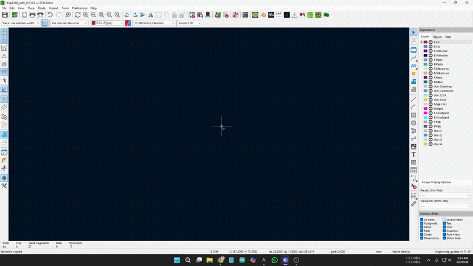

#  Round Edgecut

A KiCad Action Plugin that generates a rounded rectangle board outline on the `Edge.Cuts` layer with a live preview.

| | |
|---|---|
| **Platform** |   |
| **Package** |   |
| **Meta** |    |

---

## 📸 Demo



---

## ✨ Features

- **Specify dimensions** — Input Width, Height, and Corner Radius in millimeters
- **Rotation angle** — Rotate the board outline by any angle in degrees
- **Smart clamping** — Automatically prevents the radius from exceeding physical limits
- **Zero radius** — Generates a perfect sharp rectangle if the radius is set to 0
- **Live Preview** — Built-in preview panel updates in real-time as you type
- **Clean existing geometry** — Optional checkbox to clear any existing `Edge.Cuts` drawings
- **Custom placement** — Place at a specific X/Y position or default to page center
- **Remember settings** — Automatically saves your last used inputs

---

## 📦 Installation

### Via KiCad Plugin Manager (Recommended)
1. Open KiCad → **Plugin and Content Manager**
2. Search for **Round Edgecut**
3. Click **Install**

### Manual Installation
1. Download or clone this repository
2. Copy the `rounded_rect_plugin` folder into your KiCad plugin directory:
   - **Windows:** `%USERPROFILE%\Documents\KiCad\9.0\3rdparty\plugins`
   - **Linux:** `~/.local/share/kicad/9.0/3rdparty/plugins`
   - **macOS:** `~/Documents/KiCad/9.0/3rdparty/plugins`
3. Open pcbnew → **Tools → External Plugins → Refresh Plugins**

---

## 🚀 Usage

1. Open your PCB in KiCad
2. Click the **Round Edgecut** button in the toolbar (or via `Tools → External Plugins`)
3. Enter your desired **Width**, **Height**, **Radius**, and **Angle**
4. Check the live preview
5. Hit **OK** to generate the outline!

---

## 📁 Project Structure

```
rounded_rect_plugin/
├── __init__.py          # Plugin registration
├── plugin_action.py     # Core logic & pcbnew API
├── dialog.py            # wxPython UI & live preview
├── metadata.json        # KiCad PCM metadata
├── icon.png             # Plugin icon
├── LICENSE              # MIT License
└── README.md
```

---

## 📄 License

This project is licensed under the **MIT License** — see the [LICENSE](LICENSE) file for details.

You are free to use, modify, and distribute this plugin.

---

## 👤 Author

**Shourov Paul** — [GitHub](https://github.com/Shourov-Paul/Round-Edgecut)
